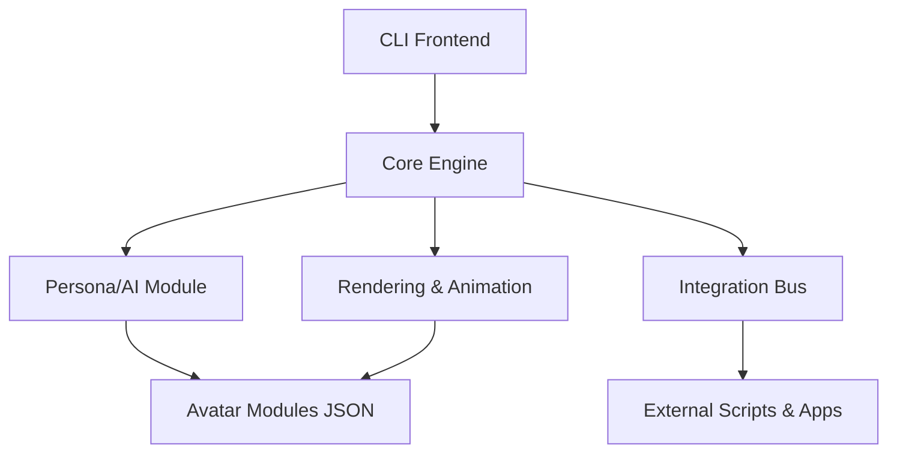

# TAPIO: Tunable AI Persona Interaction Oddity

## 1. Vision & Mission

TAPIO is a playful, modular framework that brings customizable AI-driven companions to your Linux desktop. Whether it’s a cat, robot, dos, or a mythic creature, users can add, configure, and interact with animated “avatars” that respond to commands, events, and personality scripts. TAPIO turns notifications and system hooks into a living, breathing oddity on your screen—blurring the line between utility and entertainment.

## 2. Key Concepts

- **Avatar Modules**: Packaged sets of animations, behaviors, and persona definitions (e.g., RoboticCat, SlothBot).
- **Core Engine**: Handles rendering, state management, message dispatch, and CLI parsing.
- **Persona Layer**: AI-driven scripts or rule-based behaviors (random quotes, event responses, idle animations).
- **CLI Interface**: Commands like `sloth --moveto=Dash`, `--anchor=right-border`, `--sleep` for direct control.
- **Integration Bus**: A simple local message bus or API for external tools (Taskwarrior, calendar scripts) to push notifications and events to TAPIO.

## 3. Features

- **Animated Characters**: Loadable JSON-based definitions for frames, movements, and behaviors.
- **Dynamic Commands**: Send real-time instructions to any active avatar via the CLI.
- **Event Notifications**: Display tip-bubbles or speech balloons with messages from scripts or APIs.
- **Extensibility**: Easily add new avatar packages, personality plugins, and integration adapters.
- **Lightweight & Configurable**: Written for Arch Linux (and other distros), minimal dependencies, fully themeable.

## 4. Architecture Overview



- **CLI Frontend**: Parses commands, routes to Core Engine.
- **Core Engine**: Manages avatar lifecycle and communication.
- **Rendering & Animation**: Draws frames using a lightweight graphics library (e.g., SDL2).
- **Persona/AI Module**: Hooks for rule-based or ML-driven behaviors.
- **Integration Bus**: Exposes a UNIX socket or DBus interface for event ingestion.

## 5. Getting Started

1. **Install Dependencies**: SDL2 (or alternative), Python 3.x (or Rust), DBus (optional).
2. **Clone Repository**:

   ```bash
   git clone https://github.com/yourname/tapio.git
   cd tapio
   ```

3. **Run Core**:

   ```bash
   ./tapio --avatar=SlothBot --anchor=bottom-right
   ```

4. **Send Commands**:

   ```bash
   tapio --avatar=SlothBot --moveto=100,200
   tapio --avatar=SlothBot --bubble="Hello, world!"
   ```

5. **Create Your Own Avatar**: Drop a JSON folder in `~/tapio/avatars/YourAvatarName/` and reload.

_Welcome to TAPIO—where functionality meets whimsy!_

## 7. Directory Initialization Script

Below is a sample `init_tapio.sh` Bash script to bootstrap the `~/.tapio/` structure. Make it executable (`chmod +x init_tapio.sh`) and run it to create all necessary folders and placeholder files.

```bash
#!/usr/bin/env bash

# init_tapio.sh
# Bootstraps the ~/.tapio directory structure with sample placeholders.

set -euo pipefail

# Base directory
BASE_DIR="$HOME/.tapio"

# Pet name (optional argument, default 'cat')
PET_NAME="${1:-cat}"

# Paths
PETS_DIR="$BASE_DIR/pets/$PET_NAME"
FRAMES_DIR="$PETS_DIR/frames"
PLUGINS_DIR="$BASE_DIR/plugins"
NOTIFS_DIR="$BASE_DIR/notifications"
DBUS_DIR="$BASE_DIR/dbus"
DATA_DIR="$BASE_DIR/data/sounds"

# Create directories
mkdir -p "$FRAMES_DIR"
mkdir -p "$PLUGINS_DIR"
mkdir -p "$NOTIFS_DIR"
mkdir -p "$DBUS_DIR"
mkdir -p "$DATA_DIR"

# Create placeholder files
cat > "$PETS_DIR/config.json" << 'EOF'
{
  "name": "${PET_NAME}",
  "animations": [
    "frames/idle.png",
    "frames/walk1.png",
    "frames/sleep.png"
  ],
  "anchor": "bottom-right"
}
EOF

cat > "$NOTIFS_DIR/quotes.json" << 'EOF'
[
  "Hello, world!",
  "Tapio at your service.",
  "Have a great day!"
]
EOF

# Sample DBus service file placeholder
cat > "$DBUS_DIR/org.tapio.DesktopPet.service" << 'EOF'
[D-BUS Service]
Name=org.tapio.DesktopPet
Exec=$BASE_DIR/init_tapio.sh
EOF

# Sample plugin placeholders
cat > "$PLUGINS_DIR/ai_personality.py" << 'EOF'
# ai_personality.py
# Define your AI persona hook here
def register(bot):
    pass
EOF

cat > "$PLUGINS_DIR/calendar_notifier.py" << 'EOF'
# calendar_notifier.py
# Send calendar events to Tapio via DBus or IPC

def register(bot):
    pass
EOF

chmod +x "$BASE_DIR/init_tapio.sh"

echo "Initialized TAPIO structure at $BASE_DIR (pet: $PET_NAME)"
```
